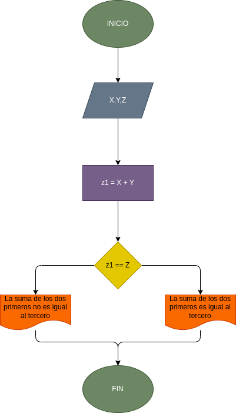

# Ejercicio. programa para determinar si dados 3 numeros enteros, la suma de los 2 primeros es igual al tercero

## Dfisinición de variables

#### X = Primer numero
#### Y = Segundo numero
#### Z = Tercer numero

## Diagrama de flujo

